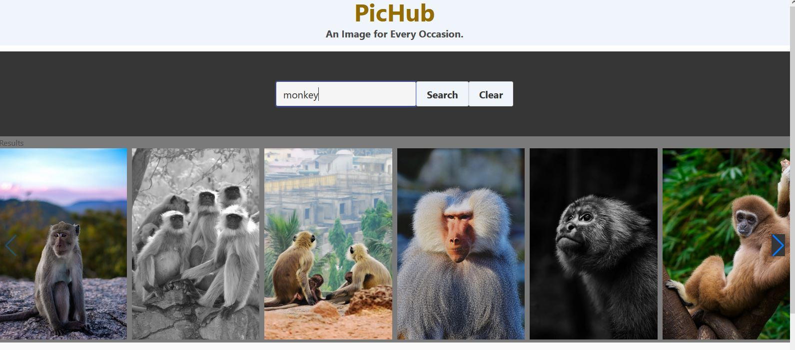

# PicHub - An Image for Every Occasion

## Purpose
A search engine using Pexels API to generate high quality professional grade photographs for personal, business, or school use. 

## User Story
AS a presenter, I need an image for my project, so WHEN I search using a relevant keyword, THEN the page should show me images corresponding to my used keyword.

## Built With
* HTML
* CSS
* JavaScript

## APIs and Frameworks
* Bulma CSS Framework
* SwiperJS
* Pexels

## Website

## Screenshot

## Contribution
Made by Ian Linton, Derek Burzloff, and Christian Henriquez